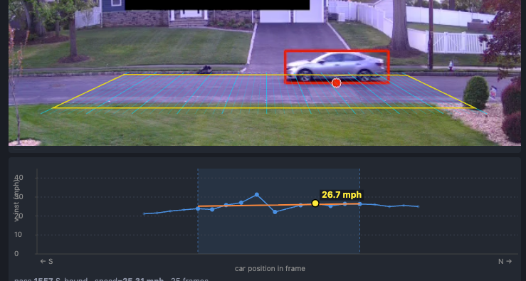
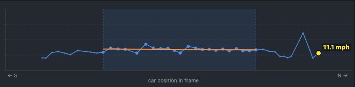

# camwatch

Local traffic-speed monitor for a residential street. Pulls a live RTSP feed from a Reolink IP camera, detects passing cars with YOLO, projects each detection through a calibrated homography into road-plane meters, fits a line to the trajectory to derive speed, and records every pass to a SQLite database with a video clip and a high-resolution thumbnail. Optional offline pass to identify each vehicle's make / model / color, with one-click "filter by this vehicle" in the UI.

> Background reading:
> - [Building CamWatch with Claude Code](https://leidevs.com/blog/camwatch/): the original two-day end-to-end build on a MacBook Air.
> - [Rebuilding camwatch's speed engine](https://leidevs.com/blog/camwatch-2/): replacing the 2-line method with homography-based trajectory regression. Validated against ground-truth drives at 15 / 25 / 35 mph.
> - [Migrating to RTX 3060, camwatch unchained](https://leidevs.com/blog/camwatch-3/): moving off the laptop, retiring the dual-stream sync layer, and unlocking reliable HD thumbnails + automated vehicle identification.



## What it does

```
RTSP frames (main stream, 2048×1536)
   ↓
YOLO11(large) detect + BotSORT track
   ↓
homography projection (pixels → road-plane meters)
   ↓
grid entry/exit trigger
   ↓
Y(t) regression → speed
   ↓
passes table + clip + HD thumbnail
```

For each car: detect, track, project bbox bottom-center through the homography matrix `H` to get `(X, Y)` meters on the road. A "pass" is a track entering the calibrated grid and later exiting it. Reported speed is the slope of a linear fit to `Y(t)` over a centered window: primary ±15 ft (where the homography is most accurate), widened to ±25 ft (full grid) when the primary has too few samples.

The web UI lets you browse passes, play clips with the calibrated grid overlaid, and click into a per-pass speed chart that visualizes which samples contributed to the headline number.



## Setup

```sh
git clone git@github.com:leochen4891/camwatch.git
cd camwatch
uv venv --python 3.12 && uv sync

cp .env.example .env                      # edit: REOLINK_USER, REOLINK_PASS
cp config/config.example.yaml config/config.yaml

uv run python scripts/test_stream.py      # smoke test: ~10-25 fps to /tmp/
```

Prerequisites: a Reolink camera with RTSP enabled, Python 3.12, and a GPU for inference. Currently tested on Linux + NVIDIA (CUDA, RTX 3060) and on macOS Apple Silicon (MPS). `device: auto` picks the right backend at startup.

## Calibration

The runtime needs one artifact: `config/homography.yaml`, a 3×3 matrix mapping main-stream pixel coordinates (2048×1536) to road-plane meters. Producing it is a physical step plus a one-shot script run.


1. **Paint 13 anchors on the road** with a tape measure: 4 corners (NE/SE/NW/SW curbs) of a 30 ft × 50 ft rectangle, plus 9 along the east curb at exact 5-foot intervals (`Y = +25, +20, ..., −20, −25 ft`, all at `X = 0`). The 9 along-the-curb anchors fix the Y scale absolutely, so reported speed doesn't depend on the road-width measurement.

2. **Capture a clean frame** with all 13 dots visible (any frame-grab tool works).

3. **Click each dot in order**:
   ```sh
   uv run python scripts/mark_points.py --frame path/to/frame.jpg --with-grid
   ```
   Writes `config/marked_points.yaml`. The `--with-grid` flag overlays the current homography's 5 ft lines so you can see drift before re-clicking; omit it on a fresh setup.

4. **Build the homography**:
   ```sh
   uv run python scripts/build_homography_from_marks.py
   ```
   Reads `marked_points.yaml`, fits via `cv2.findHomography`, writes `config/homography.yaml`. Prints per-anchor reprojection error; a healthy fit is < 10 cm mean and < 20 cm max.

5. **Verify** in the web UI by toggling Settings → Live preview → Show measurement grid on the preview.

If the camera moves, redo step 3 onward.

## Run

```sh
uv run python -m camwatch serve                       # http://127.0.0.1:8000
uv run python -m camwatch serve --host 0.0.0.0        # LAN/phone access
uv run python -m camwatch serve --profile             # log per-stage timings
```

The web UI shows the live preview, a filterable pass list with thumbnails, a 5-mph speed histogram, and a settings dialog (alarm threshold, clip margin, retention, preview grid overlay, pause-at-night). The status pill at the top reads **● live** during the day, **⏸ paused (night)** in amber when the camera switches to IR mode and the gate kicks in.

For remote access: Tailscale for personal use, Cloudflare Tunnel + Access for shareable URLs. The UI has no built-in auth.

There's also a legacy headless mode (`uv run python -m camwatch`, uses the original 2-line speed math) that writes events.jsonl + alert JPGs. Useful for diagnostics; the web UI is the canonical runtime.

## Vehicle enrichment (optional)

The `passes` table reserves columns for `vehicle_make`, `vehicle_model`, `vehicle_year_range`, `vehicle_color`, and `vehicle_confidence`. They are populated out-of-band, not by the live capture loop. The intended setup is a small hourly job that, for each new pass with an unread thumbnail, asks a vision model to identify the vehicle and writes the result back to the row. See [the camwatch-3 post](https://leidevs.com/blog/camwatch-3/#reliable-hd-then-automated-vehicle-enrichment) for the reasoning behind running this as a stateless cron tick rather than one long agent session.

When the columns are populated, the UI exposes a one-click "filter by this vehicle" action on every row. Color matching is fuzzy (silver, light-grey, off-white all bucket into "light"), so lighting drift across days does not split one repeat offender into three.

## Architecture

The hot path is a single capture-worker thread driving everything per frame:

```
camwatch/
├── capture.py          RTSP frame source. Yields (frame, pts_ts) re-anchored
│                       to monotonic time at first frame of each session.
├── detect.py           YOLO11 + BotSORT wrapper. Weights and device are
│                       read from config; default is yolo11l.pt on CUDA.
├── homography.py       Loads H from config/homography.yaml. Exposes project()
│                       and centered_speed_y_regression().
├── grid_crossing.py    "Pass" = track enters the grid then exits (or ages
│                       out while inside). Replaces the old 2-line trigger.
├── capture_worker.py   Detect → on-road filter (in-grid check) → trajectory
│                       accumulator → grid trigger → tiered regression →
│                       recorder + DB. Includes stationary-track gate
│                       (parked-curb suppression) and night-mode (IR) gate.
├── recorder.py         Ring buffer; on trigger writes a clip with the grid
│                       drawn on top + small/big thumbnails. Caps clip
│                       duration at last_in_grid_ts + post-roll, so
│                       late-firing triggers don't pad with dead air.
├── preview.py          MJPEG buffer + optional grid overlay.
├── db.py               SQLite (WAL): passes table with speed_mph,
│                       speed_method, vehicle_* columns.
├── server.py           FastAPI + Jinja2/HTMX. Includes filter-by-vehicle
│                       lookup with fuzzy color matching.
└── crossing.py, speed.py, sink.py, main.py, calibrate.py
                        Legacy 2-line code path kept for headless mode.
```

Three things make the speed measurement work:

- **Homography** maps pixels to metric road coordinates exactly (the road is a flat plane). Once you're in meters, perspective and lane choice stop mattering for speed.
- **PTS-anchored timestamps**, not wall-clock. RTSP buffers in bursts; the H.264 stream's PTS is the camera's ground truth for when a frame was captured. This was the bug that made the original speeds 3× too high before being found.
- **Centered-window regression** anchors the measurement at the part of the road where reprojection error is smallest, and tiers (widening to ±25 ft when needed) keep speed available even on short trajectories.

## Configuration

`config/config.yaml`:

```yaml
camera:        { host, port, path, static_frame_path? }   # path = main stream
model:         { weights: yolo11l.pt, device: auto, conf: 0.35 }
alert:         { threshold_mph: 40 }
speed:         { max_track_age_s: 5.0 }
retention:     { recordings_days: 7, passes_days: 365 }
clip:          { margin_s: 0.5, capture_min_mph: 0, capture_max_mph: 999 }
preview:       { show_grid: true }
capture:       { pause_at_night: true }
```

`device: auto` probes for CUDA, then MPS, then CPU. `static_frame_path` (optional) loops a JPEG instead of opening RTSP, useful for dev/test when the live camera is in use elsewhere.

Most are also editable in-app. Camera credentials in `.env` (`REOLINK_USER`, `REOLINK_PASS`).

## Project layout

```
camwatch/                 # runtime source (modules above)
config/                   # config.yaml, calibration.yaml (gitignored);
                          # marked_points.yaml + homography.yaml (tracked)
scripts/                  # mark_points.py, build_homography_from_marks.py,
                          # render_homography_overlay.py, test_stream.py,
                          # timing diagnostics
docs/images/              # README screenshots
```

Gitignored at runtime: `camwatch.db`, `events/`, `recordings/`, and `*.pt` (ultralytics auto-downloads the weights on first run).

## Scope and limitations

- **One camera, one road segment.** Multi-camera or multi-road setups need separate homographies and trigger logic.
- **Camera must not move.** Calibration is tied to the painted-anchor pixel positions. If the camera is bumped, redo the click step.
- **Auto-paused at night.** When the camera switches to IR illumination (frames go monochrome), detection pauses. Toggle off in settings if you want to capture night data, with the understanding that headlight-only readings have much higher error.
- **Tracker splits lower confidence.** When BotSORT briefly loses a car (occlusion, YOLO confidence dip) the same physical vehicle gets two track IDs. The tiered regression handles this and flags the pass with a `?` chip; a larger YOLO model would reduce the rate.
- **Single main stream.** Detection, tracking, clips, and thumbnails all come from the camera's main stream (2048×1536). The pre-migration dual-stream pipeline is gone; see [the camwatch-3 post](https://leidevs.com/blog/camwatch-3/) for the architectural rationale.
- **Vehicle enrichment is opt-in.** The DB columns and UI filter exist in the runtime, but populating them is a separate job (see the section above). Without it, the filter UI simply has nothing to match against.
