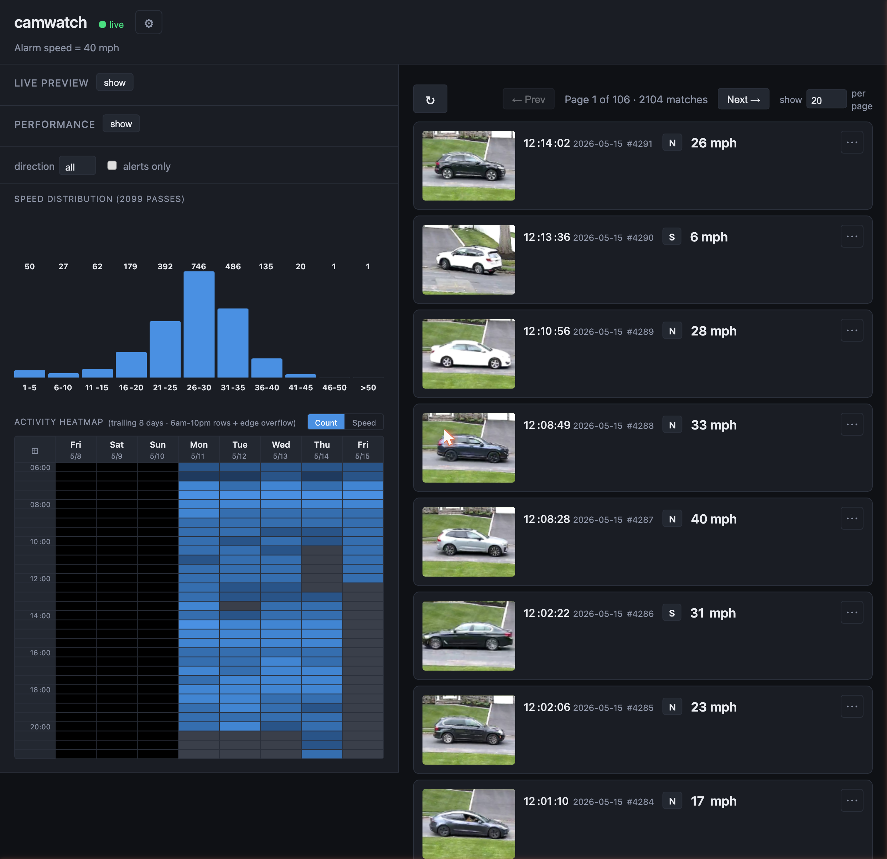
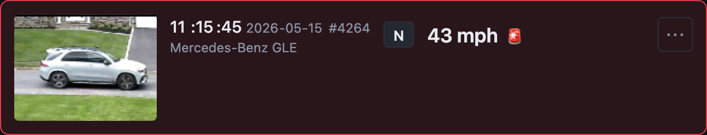
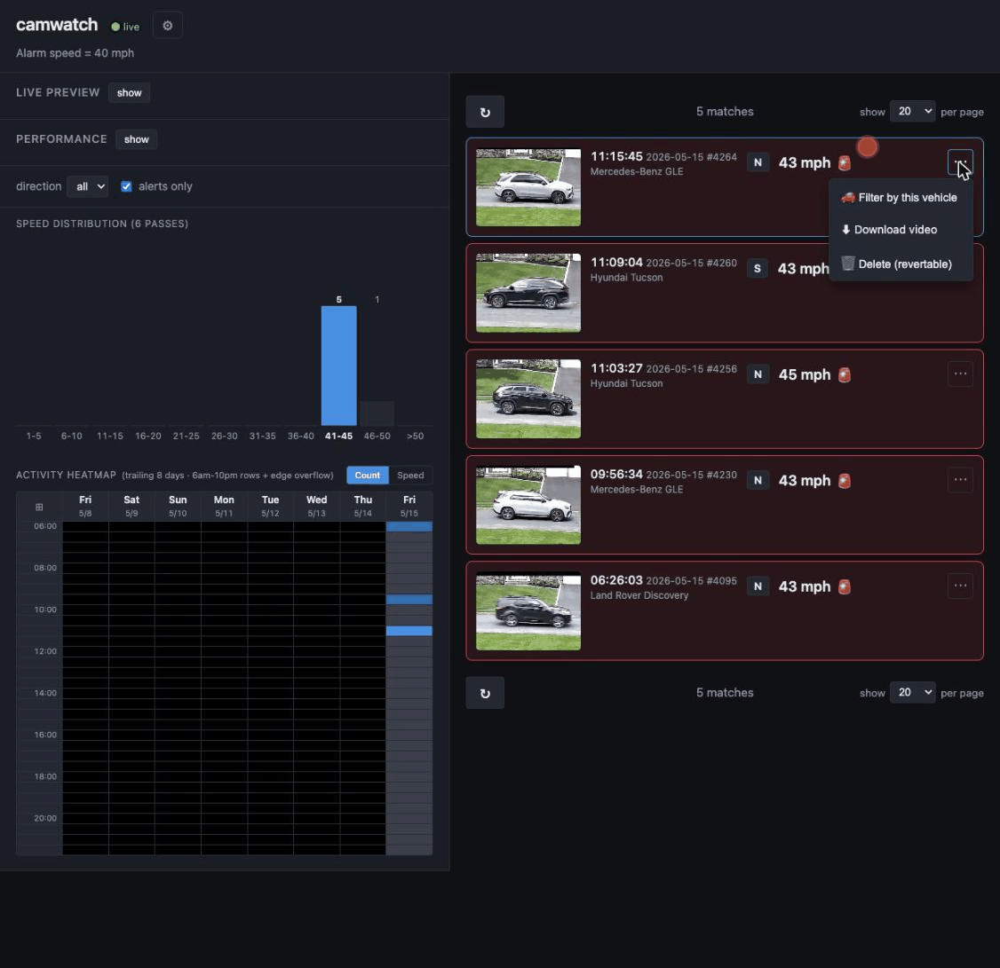
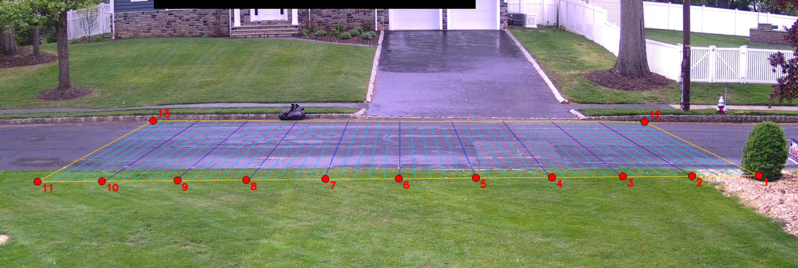
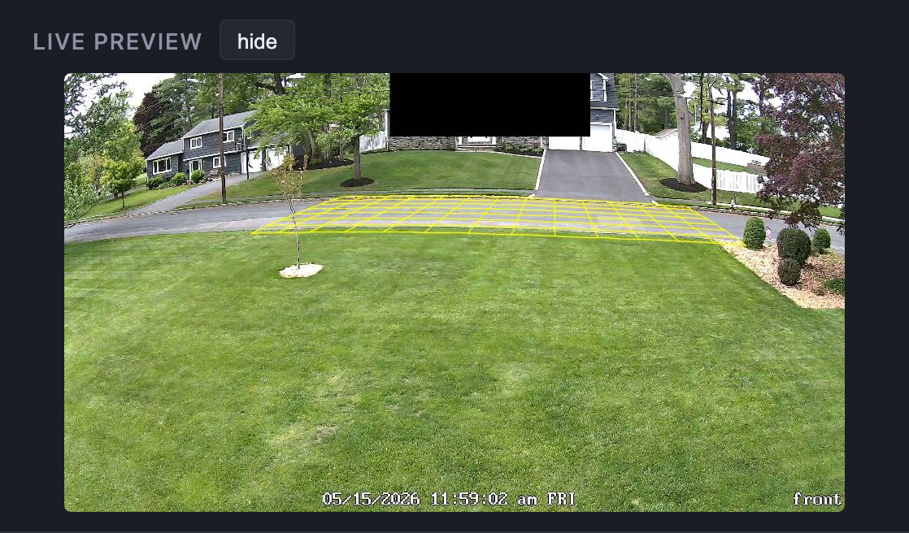

# camwatch

Local traffic-speed monitor for a residential street. Pulls a live RTSP feed from a Reolink IP camera, detects passing cars with YOLO, projects each detection through a calibrated homography into road-plane meters, derives speed from the projected trajectory, and records every pass to a SQLite database with a video clip and a high-resolution thumbnail. Optional offline pass to identify each vehicle's make / model / color, with one-click "filter by this vehicle" in the UI.



> Background reading:
> - [Building CamWatch with Claude Code](https://leidevs.com/blog/camwatch/): the original two-day end-to-end build on a MacBook Air.
> - [Rebuilding camwatch's speed engine](https://leidevs.com/blog/camwatch-2/): replacing the 2-line method with homography-based trajectory regression. Validated against ground-truth drives at 15 / 25 / 35 mph.
> - [Migrating to RTX 3060, camwatch unchained](https://leidevs.com/blog/camwatch-3/): moving off the laptop, retiring the dual-stream sync layer, and unlocking reliable HD thumbnails + automated vehicle identification.
> - [A new camera for low-light hours](https://leidevs.com/blog/camwatch-4/): swapping the E1 Outdoor for a CX410W (larger sensor, faster lens) and switching the speed math to a cumulative-distance running average that's robust to PTS-burst stutter.

## Dashboard

The web UI is a single page that updates over HTMX. Default layout: live preview and performance panel on the top-left (both collapsed by default), filters and charts below, paginated pass list on the right. The status pill in the header reads **● live** during the day and **⏸ paused (night)** in amber when the camera switches to IR mode and the night-mode gate kicks in. A gear icon next to the pill opens an in-app settings dialog (alarm threshold, clip pre/post-roll margin, clip capture mph range, grid overlay, night-mode pause, three-phase storage retention, heatmap rolling window).

### Pass list



Each row carries the thumbnail (click for full-resolution), capture time and date, sequential pass ID, vehicle make/model (when enrichment has run), N/S direction chip, reported speed in mph, an alarm marker when the speed is at or above the configured threshold, and a kebab for per-row actions: filter by this vehicle, download the clip, or soft-delete the row.

### Filter by vehicle



One click in the kebab narrows the list to that make/model. Color matching is fuzzy, so silver, light-grey, and off-white all bucket into "light" and a repeat offender doesn't fragment into three across lighting conditions.

### Charts as filters

Both the speed histogram (5-mph buckets, 1 to >50) and the activity heatmap (8-day rolling window, 6am–10pm rows with edge overflow) are clickable. Click a histogram bar to narrow the list to that speed band; click a heatmap cell, day header, or hour label to scope the list to that slot. The heatmap has a Count/Speed toggle that re-colors cells by either pass count or top mph.

## What it does

```
RTSP frames (main stream; 2560×1440 on the CX410W)
   ↓
YOLO11(large) detect + BotSORT track
   ↓
homography projection (pixels → road-plane meters; lens-undistorted first)
   ↓
grid entry/exit trigger
   ↓
running avg (cumulative distance ÷ cumulative time) → speed
   ↓
passes table + clip + HD thumbnail
```

For each car: detect, track, project bbox bottom-center through the homography matrix `H` to get `(X, Y)` meters on the road. A "pass" is a track entering the calibrated grid and later exiting it. Reported speed is a running average — at each frame `i`, the cumulative arc length along the projected trajectory divided by the elapsed time since the first sample. The final value is the headline. See [the camwatch-4 post](https://leidevs.com/blog/camwatch-4/) for the reasoning behind switching from trajectory regression.

> **Update (June 2026): the timing source is being revised.** A timing investigation found per-frame PTS on the CX-series cameras (CX410W, CX810) to be unreliable, fabricated in both directions by a camera RTP-packetizer firmware flaw, so dividing by PTS-derived elapsed time distorts the headline speed rather than being absorbed by the running average as previously assumed. Speed is moving to a two-layer scheme: a live geometry-times-measured-cadence estimate, plus an offline correction from the camera's clean FTP recordings. The architecture and decision record are the single source of truth in the **`camwatch-system`** repo (ADR-010, ADR-011); the full evidence is in [`pts_timing_investigation.md`](./pts_timing_investigation.md).

The web UI lets you browse passes and play the clip with the calibrated grid burned into the frames at write time, so the overlay travels with the file when you download it.

## Setup

```sh
git clone git@github.com:leochen4891/camwatch.git
cd camwatch
uv venv --python 3.12 && uv sync

cp .env.example .env                      # edit: REOLINK_USER, REOLINK_PASS
cp config/config.example.yaml config/config.yaml

uv run python scripts/test_stream.py      # smoke test: ~10-25 fps to /tmp/
```

Prerequisites: a Reolink camera with RTSP enabled, Python 3.12, and an NVIDIA GPU for inference. Currently tested on Linux + CUDA on an RTX 3060. `device: auto` resolves to CUDA at startup, with CPU as a fallback for non-GPU dev boxes. Camera facts (homography, measured cadence, RTSP/FTP access) come from the private `camwatch-cameras` registry, consumed as a `uv` path dependency — clone it as a sibling of this repo (`../camwatch-cameras`) before `uv sync`.

## Calibration

> **Camera facts moved to the registry (ADR-015).** The runtime now loads the
> homography (`K`/`D`/`H` + calibration resolution), the measured cadence, and
> the RTSP URL template from the elected main camera's profile in the private
> `camwatch-cameras` repo — `config/homography.yaml` and the calibration
> scripts below are superseded and kept only until the loader path has proven
> itself in production. New calibrations happen with the registry repo's
> self-contained tooling, on a live main-stream frame at full resolution;
> consumers pick the result up with a dependency bump. Which camera is elected
> main lives in this repo's `config/config.yaml` (`camera.main_id`) — election
> refuses a camera whose profile lacks a calibrated speed capability.

The section below documents the original in-repo workflow (CX410W era) and the calibration's design; the *method* still applies inside the registry repo.

The calibration artifact holds three matrices: `K` (camera intrinsics), `D` (5-coefficient lens distortion), and `H` (homography from *undistorted* pixels to road-plane meters). A wide-angle lens (the CX410W's ~89° HFOV) introduces enough barrel distortion that a homography alone can't absorb it — running with H-only gave mean reprojection error of 63 cm; the joint `K + D + H` fit drops that to ~6 cm.

`K + D` come from **scene-constrained self-calibration**, not a chessboard. The same 17 painted anchors that constrain the homography also constrain the lens distortion (14 dots must be colinear in world; 3 west-curb dots must be colinear and parallel; spacing must be 5 ft). `scipy.optimize.least_squares` solves for `(fx, k1..k3, p1, p2, H)` jointly. See `scripts/fit_distortion_from_scene.py` for the math.



You can verify the calibration end-to-end at any time from the dashboard: turn on the live preview and the grid overlay shows up on the running stream.



### First-time setup

1. **Paint 17 anchors on the road** with a tape measure:
   - **14 along the east curb** at exact 5-foot intervals (`Y = +25, +20, ..., −25, −30, −35, −40 ft`, all at `X = 0`). The east-curb spacing fixes the Y scale absolutely, so reported speed doesn't depend on the road-width measurement.
   - **3 along the west curb**: NW corner across from `Y = +25 ft`, SW corner across from `Y = −25 ft`, and the new south-extension SW across from `Y = −40 ft` (all at `X = −30 ft`).

   Painted dots can't always go on the actual curb stone (it's recessed and unreadable). The dot line ends up a few feet inboard of the curb edge; that's fine — our coordinate system is anchored to the dot line, not the curb.

2. **Capture a fresh frame and click each anchor**:
   ```sh
   uv run python scripts/mark_points.py
   ```
   Grabs a keyframe from the RTSP main stream, opens it for clicking, writes `config/marked_points.yaml`. Click order: 1–14 along the east curb north → south, then the 3 west-curb dots (new SW first, then old SW and old NW).

3. **Fit the homography**:
   ```sh
   uv run python scripts/fit_distortion_from_scene.py
   ```
   Reads `marked_points.yaml`, jointly fits `(fx, D, H)` via Levenberg-Marquardt, writes `config/homography.yaml`. Prints per-anchor reprojection error; a healthy fit is < 10 cm mean and < 20 cm max. The CX410W lens lands around 6 cm mean / 15 cm max.

### Recalibrating after a camera change or move

Use `scripts/inspect_homography.py` — a single interactive tool that combines verification, anchor drag, refit, and save. Especially handy when the camera is bumped or swapped but the painted dots haven't moved.

```sh
uv run python scripts/inspect_homography.py
```

Opens an OpenCV window with the calibration frame and the current grid projected over it. Keys:

| key | action |
|---|---|
| `1` | toggle red outer rectangle (corner anchors 1, 14, 15, 17 become draggable) |
| `2` / `3` | toggle 5 ft / 1 ft grid |
| `4` | toggle yellow X/Y axes |
| `5` | toggle all anchor dots (all 17 become draggable) |
| `r` | refresh: grab a fresh RTSP frame (anchor positions kept) |
| drag | move any visible anchor; the grid stays stale until refit |
| `c` | refit the homography from current anchor positions |
| `s` | save: writes back to `marked_points.yaml` + `homography.yaml` |
| `w` | save current view as a PNG |
| `+` / `-` | grid line thickness |
| `q` | quit |

Typical recalibration loop:

1. `r` → grab fresh frame
2. `5` → show all 17 dots; the dots show where the *current* calibration thinks they are
3. Drag each dot that's off, onto the actual painted spot in the frame
4. `c` → refit; status bar shows new mean / max reprojection error
5. Iterate steps 3 + 4 until error is small enough and visual alignment is good
6. `s` → save

Then bring the service back up (`sudo systemctl start camwatch`) and verify in the web UI: Settings → Live preview → Show measurement grid.

## Run

```sh
uv run python -m camwatch serve                       # http://127.0.0.1:8000
uv run python -m camwatch serve --host 0.0.0.0        # LAN/phone access
uv run python -m camwatch serve --profile             # log per-stage timings
```

For remote access: Tailscale for personal use, Cloudflare Tunnel + Access for shareable URLs. The UI has no built-in auth.

`uv run python -m camwatch.calibrate pick-roi` opens an interactive window to drag-adjust the YOLO region-of-interest rectangle whenever the camera is re-aimed.

## Vehicle enrichment (optional)

The `passes` table reserves columns for `vehicle_make`, `vehicle_model`, `vehicle_year_range`, `vehicle_color`, and `vehicle_confidence`. They are populated out-of-band, not by the live capture loop. The shipped setup is an hourly cron (with a 15-45 min jitter) that runs `scripts/camwatch-tick.sh`, which spawns a fresh headless Claude Code session: it scans for new passes with an unread thumbnail, asks Opus to identify the vehicle, and applies the result to the row via `scripts/enrich_apply.py`. See [the camwatch-3 post](https://leidevs.com/blog/camwatch-3/#reliable-hd-then-automated-vehicle-enrichment) for the reasoning behind running this as a stateless cron tick rather than one long agent session.

When the columns are populated, the UI exposes a one-click "filter by this vehicle" action on every row. Color matching is fuzzy (silver, light-grey, off-white all bucket into "light"), so lighting drift across days does not split one repeat offender into three.

## Architecture

The hot path is a single capture-worker thread driving everything per frame:

```
camwatch/
├── capture.py          RTSP frame source. Yields (frame, pts_ts) re-anchored
│                       to monotonic time at first frame of each session.
├── detect.py           YOLO11 + BotSORT wrapper. Weights and device are
│                       read from config; default is yolo11l.pt on CUDA.
├── homography.py       Builds K + D + H from the elected camera's registry
│                       profile (Homography.from_profile). project() runs
│                       cv2.undistortPoints first, then the 3×3 matmul.
│                       Exposes running_avg_speed() (canonical speed) and
│                       world_to_pixel() (distortion-aware overlay rendering).
├── grid_crossing.py    "Pass" = track enters the grid then exits (or ages
│                       out while inside). Replaces the old 2-line trigger.
├── capture_worker.py   Detect → on-road filter (in-grid check) → trajectory
│                       accumulator → grid trigger → running-avg speed →
│                       recorder + DB. Includes stationary-track gate
│                       (parked-curb suppression) and night-mode (IR) gate.
├── recorder.py         Ring buffer; on trigger writes a clip with the grid
│                       and speed label burned into the frames at write time,
│                       plus small/big thumbnails (occlusion-aware pick).
│                       Caps clip duration at last_in_grid_ts + post-roll, so
│                       late-firing triggers don't pad with dead air.
├── preview.py          MJPEG buffer + optional grid overlay.
├── db.py               SQLite (WAL): passes table with speed_mph,
│                       speed_method, vehicle_* columns.
├── server.py           FastAPI + Jinja2/HTMX. Includes filter-by-vehicle
│                       lookup with fuzzy color matching.
└── crossing.py, speed.py, sink.py, main.py, calibrate.py
                        Legacy 2-line code path kept for headless mode.
```

Three things make the speed measurement work:

> **Update (June 2026):** the PTS-timing assumptions in the second and third points below no longer hold for the CX-series cameras, where per-frame PTS is unreliable. See the speed-method update earlier in this README, and `camwatch-system` ADR-010/011 (with [`pts_timing_investigation.md`](./pts_timing_investigation.md) for the evidence).

- **Homography** maps pixels to metric road coordinates exactly (the road is a flat plane). Once you're in meters, perspective and lane choice stop mattering for speed.
- **PTS-anchored timestamps**, not wall-clock. RTSP buffers in bursts; the H.264 stream's PTS is the camera's ground truth for when a frame was captured. This was the bug that made the original speeds 3× too high before being found.
- **Cumulative-distance running average** anchors speed in totals rather than slopes. A brief cluster of frames sharing nearly identical timestamps perturbs the integrand only briefly; once timestamps recover, `cum_dist / cum_dt` returns to the true speed. The same burst would rotate a regression line.

## Configuration

`config/config.yaml`:

```yaml
camera:        { main_id: cx810, static_frame_path? }   # elected main camera (ADR-013);
                                                        # facts come from its registry profile
model:         { weights: yolo11l.pt, device: auto, conf: 0.35 }
alert:         { threshold_mph: 40 }
speed:         { max_track_age_s: 5.0 }
retention:     { recordings_days: 7, thumbs_days: 30, passes_days: 365 }
clip:          { margin_s: 0.5, capture_min_mph: 0, capture_max_mph: 999 }
preview:       { show_grid: true }
capture:       { pause_at_night: true }
```

`device: auto` probes for CUDA, then falls back to CPU. `static_frame_path` (optional) loops a JPEG instead of opening RTSP, useful for dev/test when the live camera is in use elsewhere. Retention runs as three independent phases: clips (`.mp4`) age out first, then thumbnails (`.jpg`), then the pass-record rows themselves — so you can keep a year of speed data without keeping a year of video.

Most are also editable in-app. Camera credentials in `.env` (`REOLINK_USER`, `REOLINK_PASS`).

## Project layout

```
camwatch/                 # runtime source (modules above)
config/                   # config.yaml, calibration.yaml (gitignored);
                          # marked_points.yaml + homography.yaml (tracked,
                          # superseded by camwatch-cameras — removal pending
                          # the loader path proving out in production)
scripts/                  # calibration tooling, superseded by the registry
                          # repo's self-contained equivalents:
                          #   mark_points.py             initial 17-dot click
                          #   fit_distortion_from_scene.py  K+D+H joint fit
                          #   inspect_homography.py      interactive drag + refit
                          #   build_homography_from_marks.py  legacy H-only fit
                          #   render_homography_overlay.py    static PNG render
                          # still current:
                          #   camwatch-tick.sh           hourly babysitter cron
                          #   enrich_apply.py            vehicle make/model fill
                          #   test_stream.py, timing diagnostics
docs/images/              # README screenshots
```

Gitignored at runtime: `camwatch.db`, `events/`, `recordings/`, and `*.pt` (ultralytics auto-downloads the weights on first run).

## Scope and limitations

- **One camera, one road segment.** Multi-camera or multi-road setups need separate homographies and trigger logic.
- **Camera must not move (much).** Calibration is tied to the painted-anchor pixel positions. Small bumps can be repaired in a few minutes with `scripts/inspect_homography.py`'s drag-refit-save loop; larger moves (significantly different angle) may need a full re-paint of the anchors.
- **Auto-paused at night.** When the camera switches to IR illumination (frames go monochrome), detection pauses. Toggle off in settings if you want to capture night data, with the understanding that headlight-only readings have much higher error.
- **Tracker splits lower confidence.** When BotSORT briefly loses a car (occlusion, YOLO confidence dip) the same physical vehicle gets two track IDs. The running-avg path handles this and flags the pass with a `?` chip in the UI; a larger YOLO model would reduce the rate.
- **Single main stream.** Detection, tracking, clips, and thumbnails all come from the camera's main stream (resolution is camera-dependent: 2048×1536 on the original E1, 2560×1440 on the current CX410W). The pre-migration dual-stream pipeline is gone; see [the camwatch-3 post](https://leidevs.com/blog/camwatch-3/) for the architectural rationale.
- **Vehicle enrichment is opt-in.** The DB columns and UI filter exist in the runtime, but populating them is a separate job (see the section above). Without it, the filter UI simply has nothing to match against.
